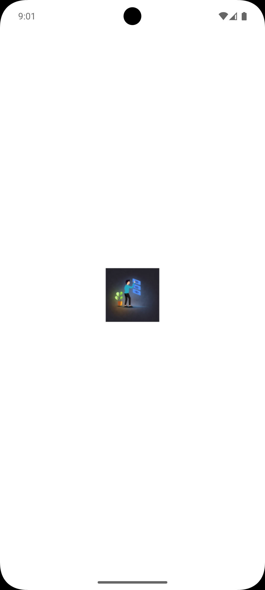
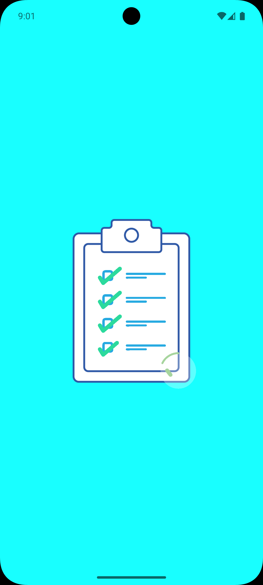
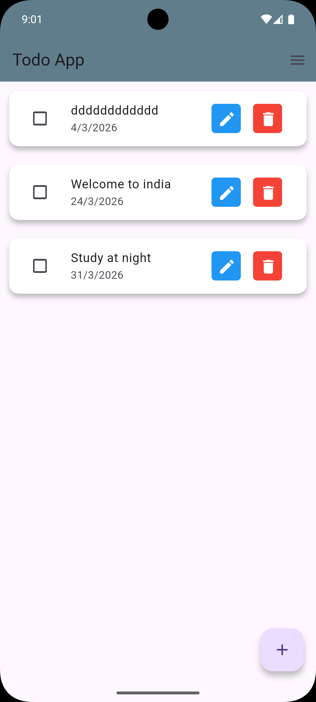
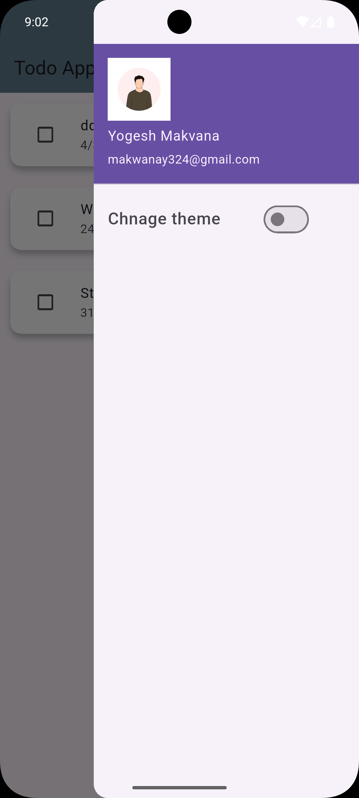
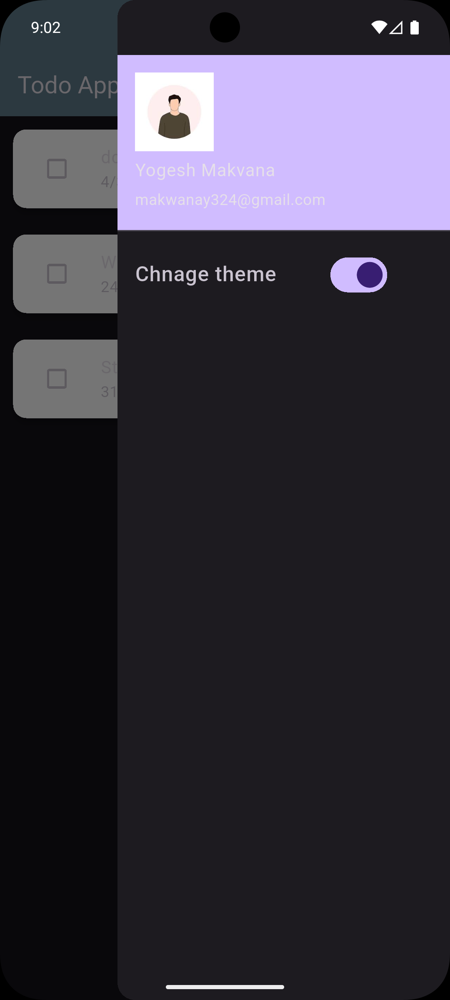
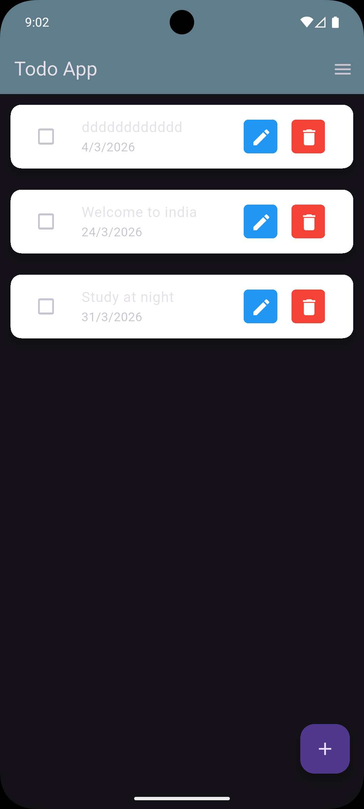
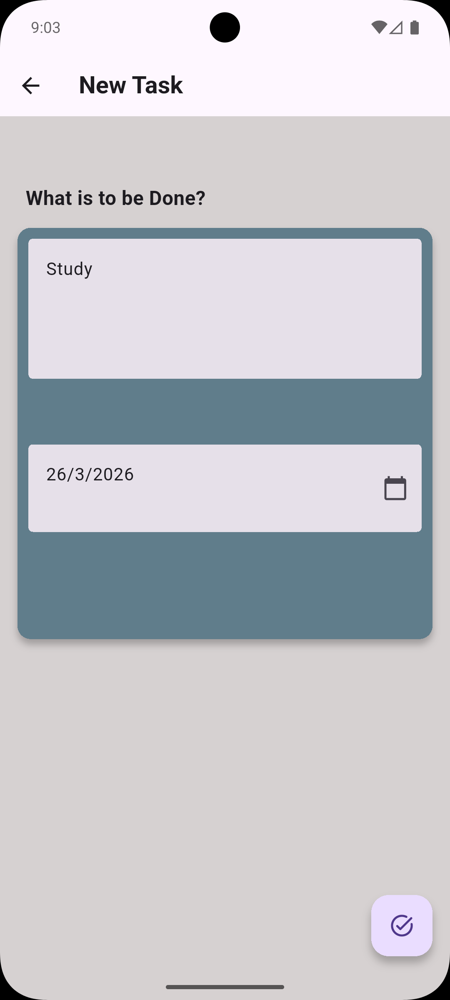

# 📝 TODO Flutter App

A modern and minimal **To-Do / Notes application** built using Flutter with a focus on clean UI, smooth animations, and efficient local storage.

---

## 🚀 Features

* ✅ Create, update, and delete tasks
* 🌙 Dark & Light Theme (using GetX)
* 💾 Local data storage using SharedPreferences
* 🎬 Lottie animations for enhanced UI/UX
* ⚡ Lightweight and fast performance
* 📱 Fully responsive design

---

## 🛠️ Tech Stack

| Technology        | Usage                              |
| ----------------- | ---------------------------------- |
| Flutter           | UI Development                     |
| Dart              | Programming Language               |
| GetX              | Theme Management (Dark/Light Mode) |
| SharedPreferences | Local Data Storage                 |
| Lottie            | Animations (Loading & Splash)      |

---

## 📂 Project Structure

```bash
lib/
├── controllers/
├── screens/
│   ├── addTodos_page.dart
│   ├── home_screen.dart
│   ├── splash_screen.dart
│   └── todo.dart
└── main.dart
```

```bash
assets/
├── app_icon/
├── lottie/
├── screenshots/
└── person.png
```

---

## 🎬 Animations

This app uses **Lottie animations** instead of traditional loaders like `CircularProgressIndicator`, providing a more modern and engaging user experience.

---

## 🌙 Theme Management

* Implemented using **GetX**
* Toggle between **Dark Mode** and **Light Mode**
* Used only for theme handling (not full state management)

---

## 💾 Data Storage

* Uses **SharedPreferences**
* Stores tasks locally on the device
* No backend required

---

# 📸 Screenshots

<p align="center">
  
  
  
</p>
<p align="center">

  
  
 
</p>
<p align="center">
 
 </p>
---

# 🎥 Demo Video


## 📦 Installation

```bash
git clone https://github.com/your-username/todo-flutter-app.git
cd todo-flutter-app
flutter pub get
flutter run
```

---

## 📌 Future Improvements

* 🔄 Cloud sync (Firebase)
* 📅 Task reminders & notifications
* 🏷️ Categories & filters
* 📊 Task analytics

---

## 🤝 Contributing

Contributions are welcome! Feel free to fork this repo and submit a pull request.

---

## 📄 License

This project is open-source and available under the MIT License.

---

## 👨‍💻 Author

**Yogesh Makwana**

---

⭐ If you like this project, don’t forget to star the repository!
